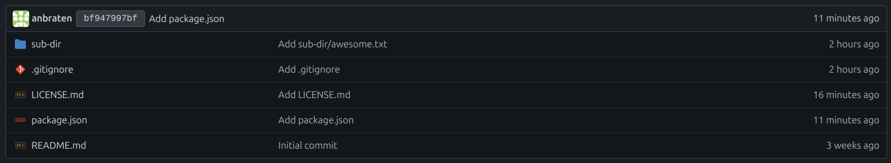

# Icons for Gitea based on Visual Studio Code

This is a demonstration of how to use icons from Visual Studio Code in Gitea.

Support added for custom file icons in: <https://github.com/go-gitea/gitea/pull/32331>



## Usage

1. Clone this repository into `data/icons/vscode` of your Gitea installation.

2. Add the following to your `custom/conf/app.ini`:

```ini
[ui]
ICON_FILE_THEME = vscode/gitea
```

3. Restart Gitea.
